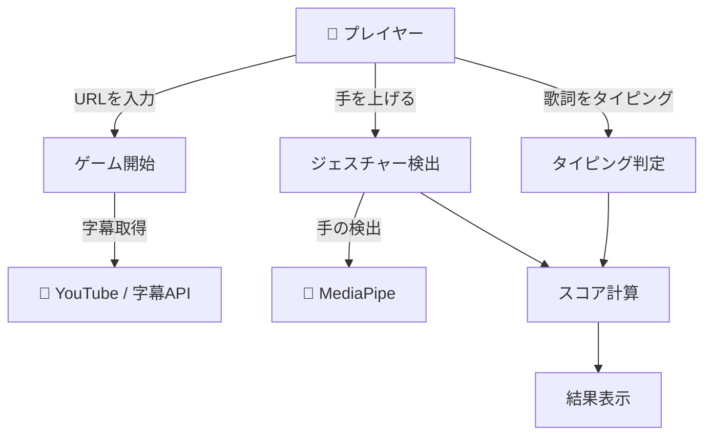
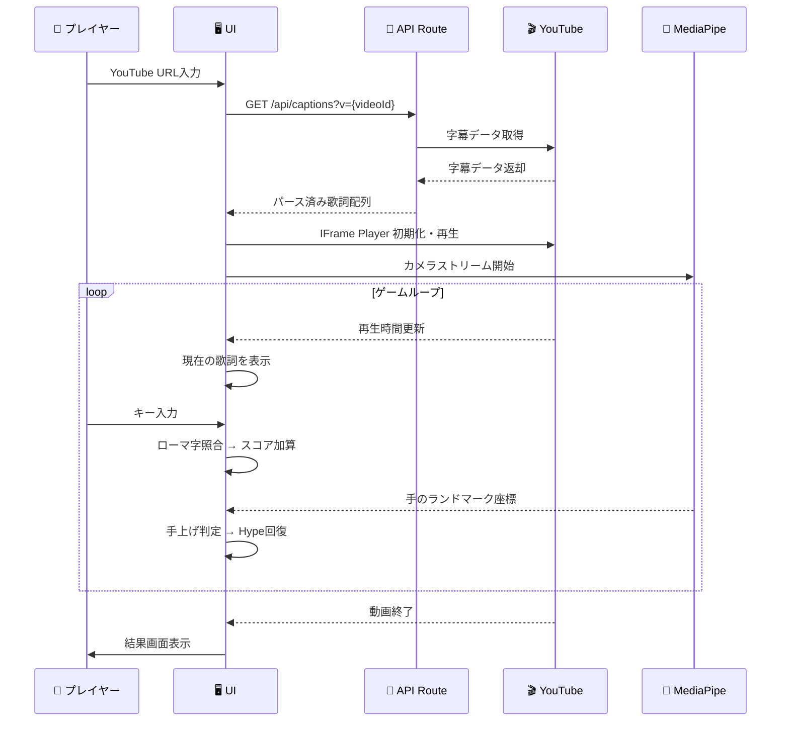

# 1. システム概要と制約事項

## 1.1 システムの目的

本システムは、
**カラオケで歌詞を覚えたい人・タイピング初心者**が**音楽に合わせた歌詞タイピング**を行う際に発生する
**曲のテンポに追いつけない・単調で飽きやすい**という課題を背景として、
**YouTube動画の字幕に対するタイピング + ハンドジェスチャーによる難易度調整（手を上げる＝単語pass＋Hype回復）**を実装し、
**楽しみながら歌詞を覚え、タイピングスキルも向上する体験**を実現することを目的とする。

## ユースケース図



## 1.2 システム範囲

#### 機能スコープ

###### 機能要件（v1 MVP - 3時間スプリント）
- YouTube動画の埋め込み再生
- YouTube字幕APIによる歌詞データ自動取得
- 字幕のローマ字変換 + タイピング判定（スペース圧縮）
- MediaPipeによるハンドジェスチャー検出（手上げ＝単語pass）
- Hype（ボルテージ）ゲージ（自然減少 + 手上げで回復）
- スコア計算（タイピング単語数 × Hype）
- ゲーム結果画面

###### 検討中の機能（v1.1以降）
- AI画像生成（字幕コンテキストから商品画像生成）
- 手上げタイル（キーワードがない時の手上げチャレンジ）
- レバレッジ大幅増加メカニクス
- ランキング・スコア保存

###### 非機能要件（対象外）
- ユーザー認証・アカウント管理
- モバイル対応
- 多言語UI
- サーバーサイドスコア保存

#### 終了条件
本システムは、"機能要件"がすべて満たされた時点で、本案件が成立したものとみなす。

## ユーザー規模・利用条件
- 想定ユーザー数：デモ向け（数人〜数十人）
- 利用環境：PCデスクトップブラウザ（Chrome推奨）+ Webカメラ
- 利用時間帯：制限なし

## 1.3 参加者と役割

| 参加者 | 役割 | 権限/責任 |
|--------|------|----------|
| 👤 プレイヤー | ゲームをプレイする | URL入力、タイピング、ジェスチャー |
| 🖥️ システム | ゲームロジック管理 | 字幕取得、判定、スコア計算 |
| 🔌 YouTube | 動画再生・字幕提供 | IFrame API + 字幕データ |
| 🔌 MediaPipe | 手のランドマーク検出 | カメラ入力 → 手の座標 |

---

# 2. 詳細なワークフロー

## 2.1 プロセス1: ゲーム開始（URL入力 → 字幕取得）

| ステップ | 処理 |
|---------|------|
| 👤 プレイヤー | `/play` にアクセスし、YouTube URLを入力 |
| 🖥️ システム | URLからvideo IDを抽出 |
| 🖥️ システム | `/play/[video_id]` にリダイレクト |
| 🔌 YouTube字幕API | video IDで字幕データ（SRT相当）を取得 |
| 🖥️ システム | 字幕をパース → タイムスタンプ付き歌詞配列に変換 |
| 🖥️ システム | 歌詞をローマ字変換（ひらがな/カタカナ → ローマ字） |
| 🖥️ システム | YouTube IFrame Player + MediaPipe初期化 |
| 👤 プレイヤー | カメラアクセス許可 |
| 🖥️ システム | ゲーム開始可能状態を表示 |

## 2.2 プロセス2: ゲームプレイ（タイピング + ジェスチャー）

| ステップ | 処理 |
|---------|------|
| 🖥️ システム | YouTube動画再生開始 |
| 🖥️ システム | 現在の再生時間に合わせて歌詞を表示 |
| 👤 プレイヤー | 表示された歌詞をローマ字でタイピング |
| 🖥️ システム | キー入力をローマ字変換済み歌詞と照合 → 正誤判定 |
| 🖥️ システム | Hypeゲージが時間経過で自然減少 |
| 👤 プレイヤー | 手を上げるジェスチャー |
| 🔌 MediaPipe | 手のランドマーク検出 → 手の位置（高さ）を返却 |
| 🖥️ システム | 手が一定高さ以上 → 「手上げ」と判定 |
| 🖥️ システム | 手上げ判定時: 現在の単語をpass + Hypeゲージ回復 |
| 🖥️ システム | 次の歌詞が来たら手上げ判定リセット（再度手を上げる必要あり） |

## 2.3 プロセス3: スコア計算 + 結果表示

| ステップ | 処理 |
|---------|------|
| 🖥️ システム | 動画終了を検知 |
| 🖥️ システム | 最終スコア = Σ(タイピング成功単語 × その時点のHype倍率) |
| 🖥️ システム | 結果画面: スコア、タイピング精度、最大コンボ表示 |
| 👤 プレイヤー | 「もう一度プレイ」or「別の曲を選ぶ」 |

---

# ワークフロー図

```mermaid
flowchart TD
    Start[/play にアクセス] --> Input[YouTube URL入力]
    Input --> Extract[Video ID抽出]
    Extract --> Redirect[/play/video_id にリダイレクト]
    Redirect --> FetchCap[字幕データ取得]
    FetchCap --> Parse[字幕パース + ローマ字変換]
    Parse --> InitYT[YouTube Player初期化]
    Parse --> InitMP[MediaPipe初期化]
    InitYT --> Ready{準備完了?}
    InitMP --> Ready
    Ready -->|Yes| Play[ゲーム開始]
    Play --> Loop{動画再生中}
    Loop -->|歌詞表示| Type[タイピング判定]
    Loop -->|手上げ検出| Gesture[Hype回復 + 単語pass]
    Loop -->|時間経過| Decay[Hype自然減少]
    Type --> ScoreCalc[スコア加算]
    Gesture --> ScoreCalc
    Loop -->|動画終了| Result[結果画面表示]
```

---

# シーケンス図



---

# 3. 異常系

## 3.1 字幕取得の異常系

| 危険な行動・状況 | 発生要因 | 防御レイヤー1（仕様） | 防御レイヤー2（実装） | 結果 |
|---------------|---------|-------------------|-------------------|------|
| 字幕がない動画のURL入力 | 字幕未設定の動画 | エラーメッセージ表示 | API側で字幕有無チェック | 「この動画には字幕がありません」表示 |
| 無効なURL入力 | タイプミス・不正URL | URL形式バリデーション | 正規表現でvideo ID抽出失敗時エラー | 「有効なYouTube URLを入力してください」表示 |
| YouTube API制限 | レート制限・サービス障害 | リトライ案内表示 | try-catch + エラーハンドリング | 「取得に失敗しました。再試行してください」表示 |

## 3.2 ゲームプレイの異常系

| 危険な行動・状況 | 発生要因 | 防御レイヤー1（仕様） | 防御レイヤー2（実装） | 結果 |
|---------------|---------|-------------------|-------------------|------|
| カメラアクセス拒否 | ブラウザ権限拒否 | ジェスチャー無しモードにフォールバック | MediaPipe初期化失敗をキャッチ | タイピングのみでプレイ可能 |
| カメラが見つからない | Webカメラ未接続 | 同上 | 同上 | 同上 |
| 動画の再生エラー | 埋め込み禁止・地域制限 | エラーメッセージ表示 | IFrame APIのonError | 「この動画は再生できません」表示 |

---

# 共通言語

| 用語 | 定義 |
|------|------|
| Hype（ボルテージ） | ゲーム中のスコア倍率ゲージ。時間経過で減少し、手上げで回復する |
| 手上げ | MediaPipeが検出する「手を上げる」ジェスチャー。単語passとHype回復をトリガーする |
| 単語pass | 現在のタイピング対象単語をスキップする機能。手上げで発動 |
| Drop | タイピング達成時に取得できるアイテム/ポイント |
| SRT | 字幕データフォーマット。タイムスタンプ付きテキスト |
| ローマ字変換 | ひらがな/カタカナをローマ字（a-z）に変換する処理 |
